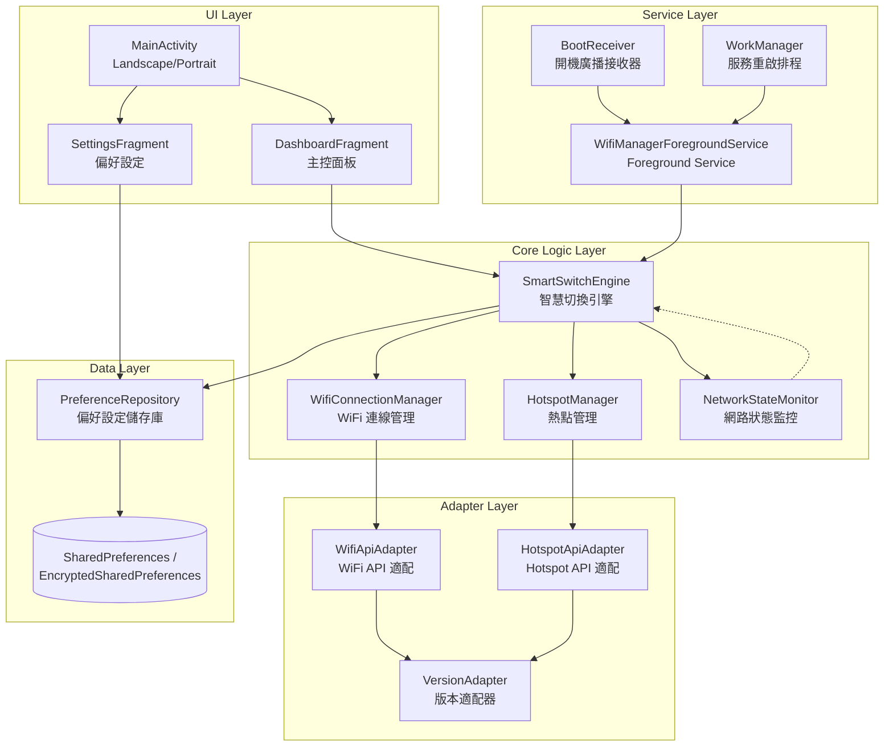
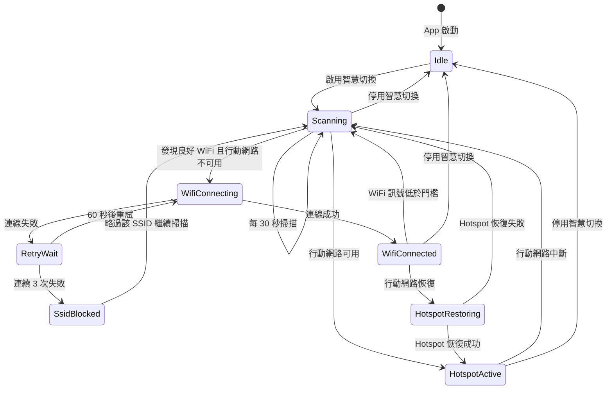
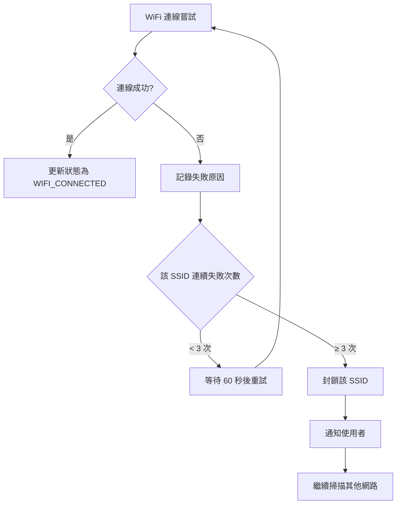

# 技術設計文件：Auto WiFi Manager

## 概述

Auto WiFi Manager 是一款 Android 原生車用 WiFi 智慧管理 App，核心功能為「智慧切換」——在偵測到良好 WiFi 訊號且行動網路不可用時，自動在 WiFi Hotspot 與 WiFi 連線之間切換。App 支援 API 28（Android 9）至 API 36（Android 16），透過版本適配層（Version Adapter）在背景處理所有 API 差異，使用者看到的永遠是一致的操作介面。

### 關鍵設計決策

1. **不儲存 WiFi 密碼**：App 完全依賴 Android 系統已記憶的 WiFi 清單，不自行管理任何認證資訊。
2. **雙模式 Hotspot 控制**：API 28-32 使用反射呼叫 `ConnectivityManager.startTethering()`（直接控制模式），API 33+ 改為 Intent 跳轉系統設定（引導控制模式），因為非特權 App 無法直接控制 Tethering。
3. **WiFi 連線雙軌策略**：API 28-29 使用 `WifiManager.getConfiguredNetworks()` + `enableNetwork()`，API 30+ 使用 `WifiNetworkSuggestion` API 搭配 `getScanResults()` 比對。
4. **Foreground Service + WorkManager**：使用 Foreground Service 維持背景掃描與切換邏輯，WorkManager 作為服務被殺後的重啟保障。
5. **Landscape-first 響應式佈局**：以 600dp 為斷點，≥600dp 使用雙欄佈局（車機），<600dp 使用單欄佈局（手機）。

### 技術研究摘要

**Hotspot 控制 API 演進：**
- API 28-32：`ConnectivityManager.startTethering()` 為隱藏 API，需透過反射呼叫。非系統 App 需要 `WRITE_SETTINGS` 權限。此方法可直接啟動/關閉 WiFi Tethering。
- API 33+：Google 進一步限制了 Tethering API 的存取，非特權 App 無法透過反射呼叫。需改用 `Settings.ACTION_WIRELESS_SETTINGS` 或 `"android.settings.TETHERING_SETTINGS"` Intent 引導使用者手動操作。

**WiFi 連線 API 演進：**
- API 28-29：`WifiManager.getConfiguredNetworks()` 可取得系統已記憶的 WiFi 清單，`WifiManager.enableNetwork()` 可直接連線。
- API 30+：`getConfiguredNetworks()` 回傳空清單（隱私限制）。改用 `WifiManager.getScanResults()` 取得周圍 WiFi，比對 SSID 判斷是否為系統已記憶網路。連線改用 `WifiNetworkSuggestion` API 建議系統連線。

**背景服務限制：**
- API 31+：禁止從背景啟動 Foreground Service（除特定例外）。需透過 `BOOT_COMPLETED` 廣播、WorkManager 的 `setForeground()` 等合法途徑啟動。
- API 34+：Foreground Service 必須宣告 `foregroundServiceType`。本 App 適用 `connectedDevice` 類型（管理 WiFi 連線裝置）。

## 架構

### 整體架構圖



### 架構模式

採用 **MVVM + Repository** 模式：
- **View**：Activity/Fragment 負責 UI 渲染與使用者互動
- **ViewModel**：管理 UI 狀態，連接 View 與 Core Logic
- **Repository**：封裝資料存取（偏好設定）
- **Service**：Foreground Service 承載背景邏輯，ViewModel 與 Service 透過 LiveData/StateFlow 共享狀態

### 技術棧

| 項目 | 選擇 | 理由 |
|------|------|------|
| 語言 | Kotlin | Android 官方推薦語言 |
| 最低 SDK | API 28 | 需求規格 |
| 目標 SDK | API 35 | Google Play 當前要求 |
| 編譯 SDK | API 36 | 最新穩定版 |
| UI 框架 | Android Views + XML | 車機相容性較佳，Compose 在舊版車機系統支援不穩定 |
| 依賴注入 | Hilt | Android 官方推薦的 DI 框架 |
| 背景任務 | Foreground Service + WorkManager | 符合 Android 背景限制 |
| 偏好儲存 | EncryptedSharedPreferences | 安全儲存偏好設定 |
| 響應式 | Kotlin Coroutines + StateFlow | 現代非同步處理 |

## 元件與介面

### 1. VersionAdapter（版本適配器）

負責偵測 Android 版本並提供功能能力查詢介面。

```kotlin
interface VersionAdapter {
    /** 取得當前 API 等級 */
    fun getApiLevel(): Int

    /** 查詢 Hotspot 控制模式 */
    fun getHotspotControlMode(): HotspotControlMode

    /** 查詢 WiFi 清單取得策略 */
    fun getWifiListStrategy(): WifiListStrategy

    /** 查詢是否需要特定權限 */
    fun getRequiredPermissions(): List<PermissionInfo>
}

enum class HotspotControlMode {
    DIRECT,   // API 28-32：可透過反射直接控制
    GUIDED    // API 33+：需引導至系統設定
}

enum class WifiListStrategy {
    CONFIGURED_NETWORKS,  // API 28-29：getConfiguredNetworks()
    SCAN_AND_SUGGEST      // API 30+：getScanResults() + WifiNetworkSuggestion
}
```

### 2. HotspotApiAdapter（Hotspot API 適配器）

封裝不同版本的 Hotspot 控制邏輯。

```kotlin
interface HotspotApiAdapter {
    /** 啟動 Hotspot，回傳操作結果 */
    suspend fun enableHotspot(): HotspotResult

    /** 關閉 Hotspot，回傳操作結果 */
    suspend fun disableHotspot(): HotspotResult

    /** 查詢當前 Hotspot 狀態 */
    suspend fun getHotspotState(): HotspotState

    /** 取得控制模式 */
    fun getControlMode(): HotspotControlMode
}

sealed class HotspotResult {
    object Success : HotspotResult()
    data class NeedUserAction(val intent: Intent) : HotspotResult()
    data class Failure(val reason: String) : HotspotResult()
}

enum class HotspotState {
    ENABLED, DISABLED, UNKNOWN
}
```

### 3. WifiApiAdapter（WiFi API 適配器）

封裝不同版本的 WiFi 連線邏輯。

```kotlin
interface WifiApiAdapter {
    /** 取得系統已記憶的 WiFi 網路（依版本使用不同策略） */
    suspend fun getKnownNetworks(): List<KnownWifiNetwork>

    /** 連線至指定 WiFi 網路 */
    suspend fun connectToNetwork(network: KnownWifiNetwork): ConnectionResult

    /** 中斷當前 WiFi 連線 */
    suspend fun disconnect(): Boolean

    /** 取得當前 WiFi 連線資訊 */
    fun getCurrentConnection(): WifiConnectionInfo?

    /** 啟動 WiFi 掃描 */
    suspend fun startScan(): List<ScanResultInfo>
}

data class KnownWifiNetwork(
    val ssid: String,
    val rssi: Int,
    val securityType: SecurityType,
    val isCurrentlyConnected: Boolean
)

sealed class ConnectionResult {
    object Success : ConnectionResult()
    data class Failure(val reason: ConnectionFailureReason) : ConnectionResult()
}

enum class ConnectionFailureReason {
    NETWORK_NOT_FOUND, AUTHENTICATION_FAILED, TIMEOUT, UNKNOWN
}
```

### 4. SmartSwitchEngine（智慧切換引擎）

核心業務邏輯，協調 WiFi 連線與 Hotspot 切換。

```kotlin
interface SmartSwitchEngine {
    /** 啟動智慧切換 */
    fun start()

    /** 停止智慧切換 */
    fun stop()

    /** 取得當前引擎狀態 */
    fun getState(): StateFlow<SmartSwitchState>

    /** 手動排除某 SSID（當次執行期間） */
    fun excludeSsid(ssid: String)

    /** 重置排除清單 */
    fun resetExclusions()
}

data class SmartSwitchState(
    val isRunning: Boolean,
    val currentMode: NetworkMode,
    val lastScanTime: Long,
    val connectedSsid: String?,
    val hotspotState: HotspotState,
    val mobileDataAvailable: Boolean,
    val knownNetworksCount: Int,
    val failedAttempts: Map<String, Int>
)

enum class NetworkMode {
    WIFI_CONNECTED,      // 已連線至 WiFi
    HOTSPOT_ACTIVE,      // Hotspot 啟用中
    MOBILE_DATA,         // 使用行動數據
    DISCONNECTED,        // 無連線
    SWITCHING            // 切換中
}
```

### 5. NetworkStateMonitor（網路狀態監控）

監控行動網路與 WiFi 狀態變化。

```kotlin
interface NetworkStateMonitor {
    /** 監聽網路狀態變化 */
    fun observeNetworkState(): StateFlow<NetworkState>

    /** 查詢行動數據是否可用 */
    fun isMobileDataAvailable(): Boolean

    /** 查詢 WiFi 是否已啟用 */
    fun isWifiEnabled(): Boolean

    /** 取得當前 WiFi 訊號強度 */
    fun getCurrentWifiRssi(): Int?
}

data class NetworkState(
    val isMobileDataConnected: Boolean,
    val isWifiConnected: Boolean,
    val wifiSsid: String?,
    val wifiRssi: Int?,
    val networkType: String?  // "4G", "5G", etc.
)
```

### 6. PreferenceRepository（偏好設定儲存庫）

管理使用者偏好設定的持久化。

```kotlin
interface PreferenceRepository {
    /** 智慧切換開關 */
    fun isSmartSwitchEnabled(): Boolean
    fun setSmartSwitchEnabled(enabled: Boolean)
    fun observeSmartSwitchEnabled(): StateFlow<Boolean>

    /** 開機自動啟動開關 */
    fun isAutoStartEnabled(): Boolean
    fun setAutoStartEnabled(enabled: Boolean)
    fun observeAutoStartEnabled(): StateFlow<Boolean>

    /** 訊號強度門檻 */
    fun getSignalThreshold(): Int  // 預設 -70 dBm
    fun setSignalThreshold(threshold: Int)

    /** 重置為預設值 */
    fun resetToDefaults()

    /** 驗證資料完整性 */
    fun validateIntegrity(): Boolean
}
```

### 7. WifiManagerForegroundService

背景服務，承載智慧切換引擎。

```kotlin
class WifiManagerForegroundService : Service() {
    // Foreground Service Type: connectedDevice
    // 顯示持續性通知，標示運作狀態
    // 透過 Hilt 注入 SmartSwitchEngine
    // 生命週期管理：onCreate → onStartCommand → onDestroy
}
```

### 8. UI 元件

```kotlin
// MainActivity：管理 Fragment 切換與螢幕方向適配
class MainActivity : AppCompatActivity()

// DashboardFragment：主控面板
// - 智慧切換主開關
// - 當前網路狀態顯示
// - Hotspot 操作按鈕
// - WiFi 連線狀態與已知網路數量
class DashboardFragment : Fragment()

// SettingsFragment：偏好設定
// - 開機自動啟動開關
// - 訊號強度門檻調整（進階）
class SettingsFragment : Fragment()

// DashboardViewModel：連接 UI 與核心邏輯
class DashboardViewModel : ViewModel()
```

## 資料模型

### 偏好設定資料結構

```kotlin
data class UserPreferences(
    val smartSwitchEnabled: Boolean = false,
    val autoStartEnabled: Boolean = false,
    val signalThreshold: Int = DEFAULT_SIGNAL_THRESHOLD
) {
    companion object {
        const val DEFAULT_SIGNAL_THRESHOLD = -70  // dBm
        const val KEY_SMART_SWITCH = "smart_switch_enabled"
        const val KEY_AUTO_START = "auto_start_enabled"
        const val KEY_SIGNAL_THRESHOLD = "signal_threshold"
    }
}
```

### WiFi 網路資料結構

```kotlin
data class KnownWifiNetwork(
    val ssid: String,
    val bssid: String?,
    val rssi: Int,
    val frequency: Int,
    val securityType: SecurityType,
    val isCurrentlyConnected: Boolean,
    val lastSeen: Long
)

enum class SecurityType {
    OPEN, WEP, WPA_PSK, WPA2_PSK, WPA3_SAE, UNKNOWN
}

data class ScanResultInfo(
    val ssid: String,
    val bssid: String,
    val rssi: Int,
    val frequency: Int,
    val capabilities: String
)

data class WifiConnectionInfo(
    val ssid: String,
    val bssid: String,
    val rssi: Int,
    val linkSpeed: Int,
    val frequency: Int,
    val networkId: Int
)
```

### 智慧切換狀態機



### 版本適配對照表

| 功能 | API 28-29 | API 30-32 | API 33-36 |
|------|-----------|-----------|-----------|
| WiFi 清單取得 | `getConfiguredNetworks()` | `getScanResults()` + 比對 | `getScanResults()` + 比對 |
| WiFi 連線 | `enableNetwork()` | `WifiNetworkSuggestion` | `WifiNetworkSuggestion` |
| Hotspot 控制 | 反射 `startTethering()` | 反射 `startTethering()` | Intent 引導至系統設定 |
| Hotspot 狀態偵測 | 反射 `getWifiApState()` | 反射 `getWifiApState()` | `WifiManager` callback |
| WiFi 連線資訊 | `getConnectionInfo()` | `getConnectionInfo()` | `NetworkCapabilities` |
| 背景服務啟動 | 直接啟動 | 需合法途徑 (API 31+) | 需合法途徑 + FGS Type |
| 所需 FGS Type | 不需要 | 不需要 (API <34) | `connectedDevice` |

### 權限矩陣

| 權限 | 用途 | API 範圍 | 必要性 |
|------|------|----------|--------|
| `ACCESS_FINE_LOCATION` | WiFi 掃描需要 | 全版本 | 必要 |
| `ACCESS_BACKGROUND_LOCATION` | 背景 WiFi 掃描 | API 29+ | 必要 |
| `ACCESS_WIFI_STATE` | 讀取 WiFi 狀態 | 全版本 | 必要 |
| `CHANGE_WIFI_STATE` | 變更 WiFi 連線 | 全版本 | 必要 |
| `ACCESS_NETWORK_STATE` | 讀取網路狀態 | 全版本 | 必要 |
| `CHANGE_NETWORK_STATE` | 變更網路狀態 | 全版本 | 必要 |
| `FOREGROUND_SERVICE` | 前景服務 | 全版本 | 必要 |
| `FOREGROUND_SERVICE_CONNECTED_DEVICE` | FGS 類型宣告 | API 34+ | 必要 |
| `POST_NOTIFICATIONS` | 通知權限 | API 33+ | 必要 |
| `RECEIVE_BOOT_COMPLETED` | 開機廣播 | 全版本 | 必要 |
| `SCHEDULE_EXACT_ALARM` | 精確排程 | API 31+ | 選用 |
| `WRITE_SETTINGS` | Hotspot 直接控制 | API 28-32 | 必要（直接模式） |
| `NEARBY_WIFI_DEVICES` | WiFi 裝置探索 | API 33+ | 必要 |

## 正確性屬性（Correctness Properties）

*正確性屬性是一種在系統所有合法執行中都應成立的特徵或行為——本質上是對系統應做之事的形式化陳述。屬性作為人類可讀規格與機器可驗證正確性保證之間的橋樑。*

### 屬性 1：版本適配映射正確性

*對於任何* API 等級在 [28, 36] 範圍內的值，VersionAdapter 產生的 `HotspotControlMode` 應為：API 28-32 → `DIRECT`，API 33-36 → `GUIDED`；產生的 `WifiListStrategy` 應為：API 28-29 → `CONFIGURED_NETWORKS`，API 30-36 → `SCAN_AND_SUGGEST`。

**驗證需求：1.2, 1.3, 2.2, 2.3, 3.1, 3.2**

### 屬性 2：智慧切換決策邏輯

*對於任何* 組合的 `(smartSwitchEnabled, mobileDataAvailable, bestKnownWifiRssi, signalThreshold)` 輸入狀態，SmartSwitchEngine 的決策應滿足以下規則：
- 若 `smartSwitchEnabled = false`，則不產生任何切換動作
- 若 `smartSwitchEnabled = true` 且 `mobileDataAvailable = false` 且 `bestKnownWifiRssi > signalThreshold`，則決策為關閉 Hotspot 並連線 WiFi
- 若 `smartSwitchEnabled = true` 且 `mobileDataAvailable = true` 且 `bestKnownWifiRssi ≤ signalThreshold`，則決策為維持行動數據並啟用 Hotspot
- 若 `smartSwitchEnabled = true` 且 `mobileDataAvailable = true` 且當前為 WiFi 連線狀態，則決策為中斷 WiFi 並恢復 Hotspot

**驗證需求：3.6, 3.7, 4.3, 4.4, 4.5**

### 屬性 3：最佳網路選擇

*對於任何* 包含多個已知 WiFi 網路的掃描結果清單與任意訊號強度門檻值，WiFi_Manager 選擇的連線目標應為所有 RSSI 超過門檻的已知網路中訊號最強者；若無任何已知網路超過門檻，則不應嘗試連線。

**驗證需求：3.5**

### 屬性 4：SSID 失敗封鎖

*對於任何* SSID 與任意連續失敗次數 N，該 SSID 被封鎖（停止自動連線嘗試）當且僅當 N ≥ 3。失敗次數 < 3 時，該 SSID 仍應保留在自動連線候選清單中。

**驗證需求：3.9**

### 屬性 5：手動排除阻止自動連線

*對於任何* 已被使用者手動中斷的 SSID，即使該 SSID 的訊號強度為所有已知網路中最高且超過門檻，SmartSwitchEngine 在當次執行期間也不應選擇該 SSID 進行自動連線。

**驗證需求：3.10**

### 屬性 6：Hotspot 狀態與 UI 狀態同步

*對於任何* HotspotState 變更事件（ENABLED → DISABLED 或 DISABLED → ENABLED），ViewModel 發出的 UI 狀態應在狀態變更後正確反映新的 Hotspot 狀態。

**驗證需求：2.5**

### 屬性 7：錯誤訊息不洩漏技術細節

*對於任何* `HotspotResult.Failure` 包含的技術性錯誤原因字串，轉換為使用者可見的錯誤訊息後，該訊息不應包含原始技術錯誤字串、例外類別名稱或堆疊追蹤資訊。

**驗證需求：2.6**

### 屬性 8：偏好設定持久化往返

*對於任何* 合法的 `UserPreferences` 物件（`smartSwitchEnabled` 為任意布林值、`autoStartEnabled` 為任意布林值、`signalThreshold` 在 [-100, -30] dBm 範圍內），將其儲存至 PreferenceRepository 後再讀取回來，應得到與原始物件相同的值。

**驗證需求：4.7**

### 屬性 9：損毀偏好設定重置為預設值

*對於任何* SharedPreferences 中的損毀狀態（包含無效型別、缺失鍵值、超出範圍的數值），PreferenceRepository 的 `validateIntegrity()` 應偵測到損毀，且後續讀取應回傳預設值。

**驗證需求：7.3**

### 屬性 10：通知內容反映運作狀態

*對於任何* `SmartSwitchState`，Foreground Service 的持續性通知內容應包含能讓使用者辨識當前運作模式（WiFi 連線中、Hotspot 啟用中、掃描中、已停用）的描述文字。

**驗證需求：5.5**

### 屬性 11：權限拒絕顯示說明

*對於任何* 被使用者拒絕的必要權限，App 應顯示該權限的用途說明訊息，且該訊息應包含重新請求權限的入口。

**驗證需求：5.4**

## 錯誤處理

### 錯誤分類與處理策略

| 錯誤類型 | 處理策略 | 使用者可見行為 |
|----------|----------|---------------|
| WiFi 連線失敗 | 記錄原因，60 秒後重試，3 次後封鎖 SSID | 通知使用者該網路暫時無法連線 |
| Hotspot 啟動失敗（直接模式） | 記錄錯誤，顯示重試提示 | 「操作未成功，請重試」 |
| Hotspot 操作不支援（引導模式） | 跳轉系統設定 | 自動開啟系統設定頁面 |
| 權限被拒絕 | 顯示權限說明，提供重新請求入口 | 說明權限用途的對話框 |
| 背景服務被殺 | WorkManager 排程重啟 | 通知可能短暫消失後恢復 |
| 偏好設定損毀 | 重置為預設值 | 通知使用者設定已重置 |
| WiFi 掃描失敗 | 記錄錯誤，下次掃描週期重試 | 無明顯使用者可見行為 |
| 行動網路狀態偵測失敗 | 使用上次已知狀態 | 無明顯使用者可見行為 |
| 版本不支援特定功能 | 自動降級至引導模式 | 功能按鈕自然引導至系統設定 |

### 錯誤訊息原則

1. **不暴露技術細節**：使用者看到的錯誤訊息僅描述操作結果與建議動作
2. **提供可行動作**：每個錯誤訊息都應包含使用者可執行的下一步
3. **記錄技術日誌**：所有技術細節記錄至 Logcat，供開發者除錯

### 關鍵錯誤流程



## 測試策略

### 測試框架與工具

| 工具 | 用途 |
|------|------|
| JUnit 5 | 單元測試框架 |
| **Kotest** | 屬性基礎測試（Property-Based Testing）框架 |
| Mockk | Kotlin mock 框架 |
| Robolectric | Android 單元測試（無需裝置） |
| Espresso | UI 整合測試 |
| Turbine | StateFlow/Flow 測試 |

### 屬性基礎測試（Property-Based Testing）

本專案使用 **Kotest Property Testing** 模組進行屬性基礎測試。每個正確性屬性對應一個屬性測試，最少執行 **100 次迭代**。

每個屬性測試必須以註解標記對應的設計文件屬性：
```
// Feature: auto-wifi-manager, Property {number}: {property_text}
```

**屬性測試涵蓋範圍：**
- 屬性 1：VersionAdapter 的 API 等級 → 控制模式映射
- 屬性 2：SmartSwitchEngine 的決策邏輯
- 屬性 3：WiFi 網路選擇演算法
- 屬性 4：SSID 失敗封鎖邏輯
- 屬性 5：手動排除邏輯
- 屬性 6：狀態同步
- 屬性 7：錯誤訊息過濾
- 屬性 8：偏好設定往返
- 屬性 9：損毀偵測與重置
- 屬性 10：通知內容正確性
- 屬性 11：權限拒絕處理

### 單元測試

單元測試聚焦於：
- 特定範例與邊界條件（屬性測試未涵蓋的具體場景）
- 元件間整合點
- UI 元素存在性與佈局驗證（需求 6.x 的 UI 尺寸約束）
- 生命週期行為（onResume 時的狀態重新偵測）

### 整合測試

整合測試涵蓋：
- Foreground Service 啟動與通知顯示
- WorkManager 排程與服務重啟
- BootReceiver 開機廣播處理
- 實際 SharedPreferences 讀寫
- WiFi 掃描定時器（30 秒間隔）

### 測試分層

```
┌─────────────────────────────────────┐
│         UI Tests (Espresso)         │  ← 佈局適配、元素尺寸、方向切換
├─────────────────────────────────────┤
│     Integration Tests (Android)     │  ← Service、WorkManager、Broadcast
├─────────────────────────────────────┤
│   Property Tests (Kotest + Mockk)   │  ← 11 個正確性屬性，每個 100+ 迭代
├─────────────────────────────────────┤
│    Unit Tests (JUnit 5 + Mockk)     │  ← 邊界條件、具體範例、錯誤路徑
└─────────────────────────────────────┘
```

